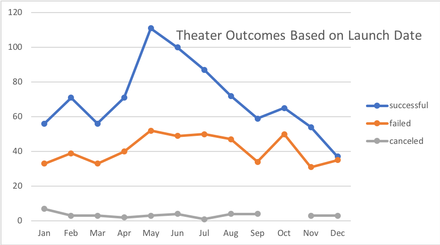
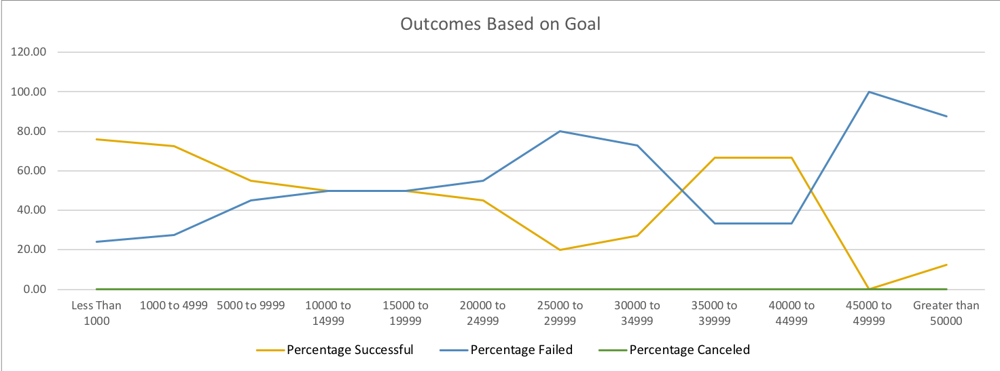

# An Analysis of Theater Kickstarter Campaign Outcomes in Relation to Launch Date and Goal Amount

## Overview of Project

This analysis was undertaken to illustrate the relationship between the success or failure of a Kickstarter campaign in relation to the date at which the campaign was launched and then to the fundraising goal set at its inception. Kickstarter campaigns in the broad category of theater and then specifically in the subcategory of plays were examined to provide the client, Louise, insight applicable to the nearly funded Kickstarter campaign for her play "Fever". 

## Analysis and Challenges

### Analysis of Outcomes Based on Launch Date 

To determine whether the date on which a theater campaign was launched can be used to better predict its outcome, a total of 1,369 Kickstarter theater campaigns launched between 2009 and 2017 were categorized by their outcome (successful, failed, or canceled) and then charted by month based on their launch date. The resulting figure is shown below: 

The figure shows that there were more successful theater campaigns launched in May (111) than any other month, with June close behind (100). The chart also shows that these were the months with the most campaigns launched total (May had the highest with 166 total campaigns), but even so it is clear that while the number of failed campaigns is also relatively high at this time, they do not rise in proportion to the number of successful campaigns, giving the these months both a higher percentage and total number of successful campaigns. Further more, it can be seen that while the number of failed kickstarter campaigns remained fairly consistent throughout the year, more campaigns failed proportionately (and in total) in December than in any other month with 35 failed and 37 successful campaigns. 

### Analysis of Outcomes Based on Goals

Further analysis was performed on a subset of 1053 plays within the theater category to illustrate the success rates of play campaigns in relation to their fundraising goal. The figure below shows the percent successful and percent failed of plays broken down into 12 fundraising goal brackets, beginning with campaigns with less than $1,000 goals and then increasing by $5,000 in each subsequent bracket until the final bracket, which contains all goal amounts above $50,000. 

As shown in the figure, the success rate is highest for play campaigns with small goals, with campaigns with goals of less than $1,000 being successful 75.8 percent of the time. Success rate gradually drops as the goal amount increases, plateauing briefly at 50% for campaigns with goals bewteen $10,000 and $19,999, before dropping 50% at the $20,000-$24,999 bracket. There is a brief spike in success rates for campaigns with goals between $35,000 and $44,999 (66.7% success rate) before dropping once again. There were no play campaigns canceled within the dataset. 

### Challenges and Difficulties Encountered

The greatest challenge to understanding these datasets is that a small number of successful play campaigns with very large goals skews the data to the right, making it important to recognize that even though the success rates of plays with goals between $35,000 and $44,999 was relatively high, there was a total of only 9 plays in these two brackets, as compared to 186 total plays with goals under $1,000. In fact, over half of all plays belonged to the first two brackets (goals under $5,000) and the median goal for a successful play was $2,500.00 (mean $4,100.83). This fact underlies an important caveat and suggests that plays with large goal amounts should be treated more as special cases than models. 

## Results

Examining the campaigns based on launch date, it can be concluded that the best time to launch a theater Kickstarter is during the month of May, and if May is not possible, June is a strong second. Alternately, it would not be advised to launch a theater Kickstarter in December. In a future analysis, it may be beneficial to examine only plays, as the above analysis looked at the category of theater as a whole. Furthermore, it may be illuminating to build a stacked line graph that showed the outcomes of campaigns based on launch date for every year from the dataset (and to the present) to see whether monthly trends hold up from year to year. 

Based on the analysis of play campaign outcomes and their fundraising goal, it can be concluded that in general, a play has a higher chance for success the lower its goal, with the success rate dropping below 50% at around $20,000, at which point a campaign is more likely to fail that succeed. Though the analysis shows another late peak for campaigns with goals between $35,000 and $44,999, a histogram of the number of plays within each goal amount bracket would show that the majority of plays had goals that were much lower, and that this peak should be taken with a grain of salt. To better understand this aspect of the data further, success rate for plays exclusively with goals similar to "Fever" should be explored.

In addition to the the further anaylses mentioned above, this data set could be improved by the inclusion of data from the years 2018-present, as this will certaintly be the most pertinent to Louise and the campaign for "Fever". Another side of the campaign story not told by this data are the components of a successful Kickstarter campaign, such as the number and type of pledge incentives and the frequency and media used for campaign updates.
